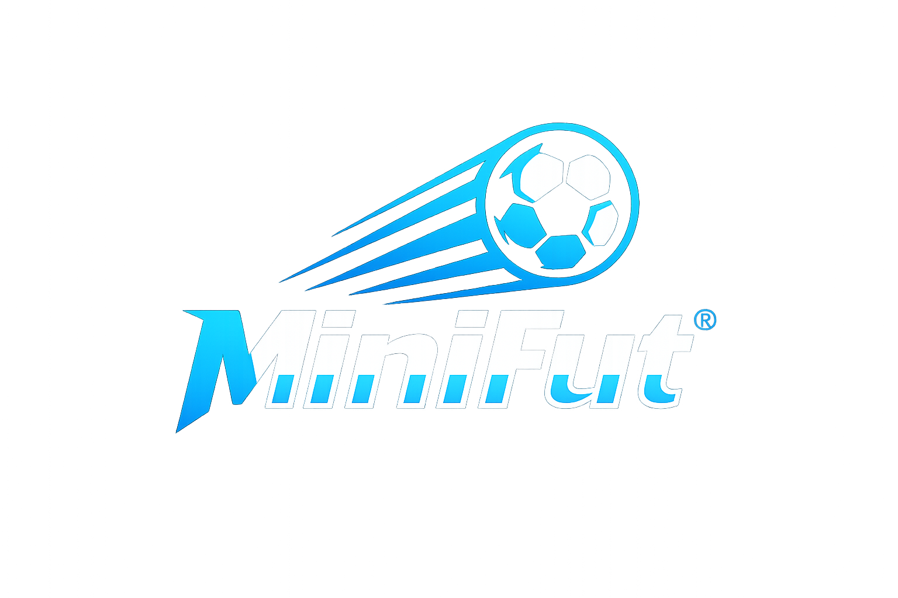

# ⚽ MiniFut – Futebol 2D

**MiniFut** é um jogo de futebol 2D onde você pode jogar sozinho contra uma IA ou desafiar um amigo no modo PvP. Com design retrô moderno e controles simples, MiniFut proporciona partidas rápidas e divertidas.

---

## 🎮 Modos de Jogo

- 👥 **Jogador vs Jogador** – dois jogadores no mesmo teclado.
- 🤖 **Jogador vs IA** – jogue contra uma inteligência artificial com comportamento reativo.

---

## 🕹️ Controles

### Jogador Azul (P1)
- `W`, `A`, `S`, `D` – movimentar
- `Barra de Espaço` – chutar

### Jogador Vermelho (P2 ou IA)
- `Setas ↑ ← ↓ →` – movimentar
- `Enter` – chutar

---

## 🧠 Funcionalidades

- ⏱️ Cronômetro de 5 minutos
- 🧠 IA reativa (PvAI)
- 🎯 Sistema de colisões (jogadores e bola)
- 🥅 Detecção de gol e mensagem animada
- 📱 Layout responsivo com design moderno
- 🎨 Estilização com TailwindCSS

---

## 🛠️ Tecnologias

- HTML5
- CSS3 + TailwindCSS
- JavaScript puro (Canvas 2D)

---

## Autor
Desenvolvido por Davi Santana

---

## 📜 Licença
Este projeto está licenciado sob a licença MIT.